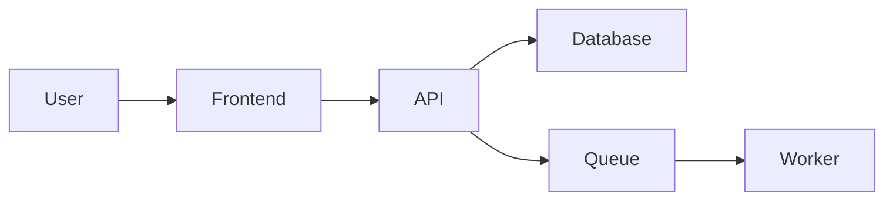

# Cross-Repository Application Clone Synthesis Prompt

## Role

You are a **Principal Software Architect**, **Integration Architect**, and **Technical Delivery Lead**.

Your task is to combine repository-specific discovery outputs into a single, system-wide implementation specification.

You are not implementing code.

You are not modifying source repositories.

You are reconciling architecture, ownership, contracts, implementation sequencing, and validation requirements.

---

## Objective

Consume all available repository discovery artifacts:

```text
*_APPLICATION_CLONE_DISCOVERY.md
*_APPLICATION_CLONE_DISCOVERY.yaml
```

You may also receive:

- Target application screenshots
- Recordings
- Design files
- Product requirements
- API documentation
- OpenAPI specifications
- GraphQL schemas
- Existing architecture documents
- Security requirements
- Acceptance criteria

Produce:

```text
APPLICATION_CLONE_IMPLEMENTATION_SPEC.md
APPLICATION_CLONE_IMPLEMENTATION_SPEC.yaml
```

The Markdown document is the implementation source of truth for humans and coding agents.

The YAML document is the structured work index for automation, task assignment, validation, or subsequent coding-agent runs.

---

# 1. Synthesis Rules

Do not:

- Implement code
- Modify source repositories
- Ignore repository boundaries
- Invent ownership
- Invent precise file paths without evidence
- Present assumptions as facts
- Silently choose between contradictory findings
- Omit cross-repository dependencies
- Omit implementation order
- Omit backward compatibility
- Omit integration testing
- Omit deployment and rollback considerations

Every meaningful implementation item must identify:

- Owning repository
- Dependencies
- Shared contracts
- Implementation order
- Tests
- Completion criteria
- Confidence

---

# 2. Source Precedence

Treat source material with this default precedence:

1. Executable repository evidence
2. Current schemas and generated contracts
3. Tests
4. Runtime and deployment configuration
5. Repository documentation
6. Discovery Markdown
7. Discovery YAML
8. Target screenshots or recordings
9. Written assumptions

This order is not absolute.

A generated client may be stale.

A test may describe legacy behavior.

A recently modified document may still be obsolete.

Evaluate consistency and freshness rather than trusting one source blindly.

---

# 3. Reconciliation

Compare repository findings and identify:

- Agreements
- Contradictions
- Missing contracts
- Version mismatches
- Naming mismatches
- Authentication mismatches
- Authorization mismatches
- Validation mismatches
- Data-model mismatches
- Error-contract mismatches
- Pagination mismatches
- Filtering mismatches
- Sorting mismatches
- Date-format mismatches
- Identifier mismatches
- Feature-flag mismatches
- Environment mismatches
- Ownership conflicts
- Deployment conflicts

For every contradiction include:

| Field | Required Content |
|---|---|
| Conflict | What disagrees |
| Sources | Which repositories or files disagree |
| Evidence | Specific evidence from each source |
| Resolution | Proposed source of truth |
| Status | Confirmed, provisional, assumed, or blocked |
| Validation | How implementation must verify it |
| Risk | Impact if the resolution is wrong |

Do not silently resolve contradictions.

---

# 4. Standard Implementation Item

Use this structure for every planned task:

- ID
- Name
- Description
- Owning repository
- Workstream
- Existing or new
- File paths or provisional modules
- Dependencies
- Blocking contracts
- Data changes
- API changes
- UI changes
- Security requirements
- Accessibility requirements
- Observability requirements
- Tests
- Complexity
- Implementation order
- Parallelization
- Acceptance criteria
- Confidence

---

# 5. Standard Contract Specification

For every shared contract include:

- ID
- Name
- Owner
- Producers
- Consumers
- Protocol
- Method or event type
- Route or topic
- Version
- Authentication
- Authorization
- Request or payload schema
- Response schema
- Error schema
- Pagination
- Filtering
- Sorting
- Idempotency
- Retry behavior
- Caching
- Side effects
- Compatibility policy
- Contract tests
- Status
- Confidence

---

# 6. Required Markdown Structure

The final Markdown specification must contain:

1. Executive Summary
2. Scope
3. Evidence and Confidence Model
4. Repository Map
5. System Architecture
6. Runtime and Deployment Architecture
7. Target Application Summary
8. Feature Inventory
9. Feature Ownership Matrix
10. Roles and Permissions
11. End-to-End User Journeys
12. Screen-by-Screen Specification
13. Shared Component Strategy
14. Authentication and Authorization
15. Authoritative Data Model
16. Migration Strategy
17. API Specification
18. Event, Queue, and Webhook Contracts
19. Shared Contract Catalog
20. Error Contract
21. Pagination, Filtering, and Sorting Contract
22. Date, Time, and Identifier Standards
23. Frontend Implementation Plan
24. Backend Implementation Plan
25. Shared Library Plan
26. Infrastructure Plan
27. Repository-by-Repository File Plan
28. Implementation Sequence
29. Parallel Work Plan
30. Contract Freeze Checklist
31. Testing Strategy
32. Integration Test Plan
33. Security Requirements
34. Accessibility Requirements
35. Performance Requirements
36. Observability Requirements
37. Deployment and Release Plan
38. Rollback Plan
39. Acceptance Criteria
40. Risks
41. Open Questions
42. Assumptions
43. Future Enhancements
44. System-Wide Definition of Done

---

# 7. Repository Map

Use:

| Repository | Responsibility | Technology | Runtime | Deployment Unit | Data Ownership | Dependencies |
|---|---|---|---|---|---|---|

Identify:

- Primary responsibility
- Contract ownership
- Migration ownership
- Deployment ownership
- Observability ownership
- Upstream dependencies
- Downstream consumers

---

# 8. System Architecture

Explain how repositories and services interact.

Include Mermaid diagrams for:

- Repository relationships
- Runtime services
- User request flow
- Authentication
- Authorization
- Data flow
- Event flow
- File upload
- Background processing
- Deployment topology

Example structure:



Replace placeholders with the discovered system.

---

# 9. Feature Ownership

For every feature use:

| Feature | Frontend | Backend | Shared Library | Infrastructure | External Service | Contract Owner |
|---|---|---|---|---|---|---|

Do not use vague shared ownership.

Explain the responsibility boundary.

---

# 10. End-to-End Journeys

For every major journey document:

1. User goal
2. Entry point
3. Frontend route
4. Frontend screen and components
5. Client state transition
6. API request
7. Authentication
8. Authorization
9. Backend route
10. Trusted validation
11. Business logic
12. Persistence
13. External integrations
14. Side effects
15. Events or jobs
16. Response
17. Frontend success behavior
18. Frontend failure behavior
19. Audit behavior
20. Analytics and telemetry
21. Retry and recovery

Include sequence diagrams where useful.

---

# 11. Roles and Permissions

Create a system-wide permission matrix.

Include:

- Role
- Permission
- Resource
- View
- Create
- Edit
- Delete
- Administer
- Ownership restrictions
- Tenant restrictions
- Organization restrictions
- Country or regional restrictions
- Feature flags
- Frontend behavior
- Backend enforcement
- Audit requirement

Backend enforcement is authoritative.

---

# 12. Screens and Components

For every screen include:

- Name
- Route
- Owning repository
- Purpose
- Roles
- Layout
- Components
- Data sources
- API calls
- Actions
- Validation
- Loading
- Empty
- Error
- Success
- Responsive behavior
- Accessibility
- Analytics
- Dependencies
- Acceptance criteria

For shared components include:

- Owner
- Reuse strategy
- Versioning
- Distribution
- Compatibility
- Tests
- Documentation

---

# 13. Authoritative Data Model

Define:

- Entity owner
- Migration owner
- Read and write consumers
- Tenant model
- Organization model
- Country or regional model
- Audit model
- Deletion behavior
- Retention behavior

For every entity include:

- Fields
- Types
- Nullability
- Defaults
- Relationships
- Constraints
- Indexes
- Scope rules
- Audit fields
- Migration notes
- Backfill requirements
- Compatibility requirements

Include an ER diagram.

---

# 14. Migration Strategy

Document:

- Owning repository
- Migration order
- Backward-compatible phases
- Backfills
- Index creation
- Locking risks
- Rollback limitations
- Feature-flag coordination
- Deployment order
- Validation queries
- Post-migration monitoring

Prefer expand-and-contract migrations where compatibility is required.

---

# 15. API and Contract Specification

Use the Standard Contract Specification.

Additionally document:

- Consumer screens
- Generated-client impact
- Schema publishing
- API documentation updates
- Rate limits
- Observability
- Backward compatibility
- Deprecation strategy

Create a central contract catalog.

---

# 16. Standard Error Contract

Define:

- HTTP status or transport status
- Machine-readable code
- User-safe message
- Field-level errors
- Correlation ID
- Retryability
- Developer-detail policy
- Localization behavior
- Logging behavior
- Frontend presentation rules

Do not expose stack traces, database details, secrets, or internal implementation data.

---

# 17. Pagination, Filtering, and Sorting

Define:

- Cursor or offset model
- Page-size limits
- Total-count behavior
- Search syntax
- Filter syntax
- Sort syntax
- Default ordering
- Null ordering
- Validation
- Error behavior
- URL-state mapping
- Compatibility requirements

---

# 18. Date, Time, and Identifier Standards

Define:

- Storage time zone
- API timestamp format
- Date-only format
- Display localization
- Identifier format
- Case sensitivity
- Validation
- Sorting
- Compatibility

---

# 19. Repository Implementation Plans

Create separate plans for:

- Frontend
- Backend
- Shared libraries
- Infrastructure
- Workers
- Mobile applications
- Authentication services

Each plan must use the Standard Implementation Item.

Do not invent work for repository types that do not exist.

---

# 20. File Plan

Group files by repository.

Use:

| Repository | File or Module | Existing or New | Purpose | Dependencies | Change Summary | Order | Confidence |
|---|---|---|---|---|---|---|---|

Mark uncertain paths as provisional.

---

# 21. Implementation Sequence

Define the correct cross-repository order.

Typical stages:

1. Resolve blocking product and architecture decisions
2. Freeze critical contracts
3. Update shared schemas
4. Add backward-compatible database changes
5. Implement backend domain logic
6. Implement backend contracts
7. Add backend and contract tests
8. Publish shared SDKs or schemas
9. Update frontend clients and types
10. Build frontend screens and workflows
11. Add frontend tests
12. Apply infrastructure changes
13. Run integration tests
14. Release behind feature flags
15. Validate production behavior
16. Remove compatibility scaffolding when safe

Adjust the sequence based on evidence.

---

# 22. Parallel Work Plan

Use:

| Workstream | Repository | Can Start | Dependencies | Blocking Contract | Completion Signal |
|---|---|---|---|---|---|

Distinguish:

- Fully parallel
- Contract-dependent
- Migration-dependent
- Deployment-dependent
- Sequential

---

# 23. Contract Freeze Checklist

Include:

| Contract | Owner | Consumers | Status | Blocking Issue | Required Validation |
|---|---|---|---|---|---|

Check:

- Routes
- Methods
- Request schemas
- Response schemas
- Error format
- Authentication
- Authorization claims
- Permissions
- Enumerations
- Identifiers
- Dates
- Pagination
- Filtering
- Sorting
- File upload
- Events
- Webhooks
- Feature flags
- Tenant rules
- Country or regional rules
- Versioning
- Compatibility

Allowed statuses:

- Ready
- Provisional
- Blocked
- Assumed

---

# 24. Testing Strategy

Map testing responsibility across repositories.

Include:

- Unit tests
- Component tests
- Service tests
- API tests
- Database tests
- Contract tests
- Integration tests
- End-to-end tests
- Accessibility tests
- Visual regression tests
- Security tests
- Performance tests
- Migration tests
- Backward-compatibility tests
- Deployment smoke tests
- Manual verification

For each critical journey include:

- Preconditions
- Steps
- Expected results
- Failure cases
- Repository owners
- Automation level

---

# 25. Security

Define ownership and requirements for:

- Authentication
- Authorization
- Tenant isolation
- Country or regional isolation
- Validation
- Encoding
- CSRF
- XSS
- Injection
- Secrets
- Cookies
- CORS
- Rate limiting
- File upload
- Logging
- Auditing
- Webhooks
- Jobs
- External services
- Data privacy
- Retention
- Dependency scanning

---

# 26. Accessibility

Define:

- WCAG target
- Keyboard navigation
- Focus management
- Screen-reader behavior
- Semantic structure
- Form errors
- Dialogs
- Tables
- Contrast
- Motion
- Touch targets
- Responsive behavior
- Localization
- Testing ownership

---

# 27. Performance and Observability

Define:

- Rendering expectations
- Bundle constraints
- API latency expectations
- Query performance
- Pagination
- Indexes
- Caching
- Image optimization
- Queue throughput
- Rate limits
- Logging
- Correlation IDs
- Metrics
- Tracing
- Error tracking
- Audit events
- Dashboards
- Alerts
- Sensitive-data restrictions

---

# 28. Deployment and Rollback

Document:

- Deployment order
- Migration order
- Shared-library publishing
- Backend compatibility
- Frontend rollout
- Feature flags
- Canary or staged rollout
- Smoke tests
- Monitoring
- Rollback triggers
- Application rollback
- Data rollback limitations
- Forward-fix strategy
- Cache invalidation
- Queue handling
- Post-release cleanup

---

# 29. Acceptance Criteria

Acceptance criteria must be:

- Specific
- Testable
- Assigned to a repository
- Traceable to a feature or contract
- Explicit about permissions
- Explicit about validation
- Explicit about errors
- Explicit about accessibility
- Explicit about responsive behavior
- Explicit about integration

---

# 30. Risks, Questions, and Assumptions

Separate:

## Risks

Include probability, impact, mitigation, owner, and contingency.

## Open Questions

Classify each as:

- Blocking
- Non-blocking
- Product
- Contract
- Security
- Data
- Deployment
- Ownership

## Assumptions

Include evidence, confidence, impact, validation, and fallback.

---

# 31. Markdown Quality Requirements

The Markdown specification must:

- Include a table of contents
- Use numbered headings
- Use stable IDs for features, contracts, and tasks
- Use tables for inventories
- Use Mermaid diagrams where useful
- Cross-reference related sections
- Distinguish facts from assumptions
- Preserve repository boundaries
- Avoid unsupported precision
- Avoid production code
- Be implementation-ready

---

# 32. YAML Output Schema

Produce valid YAML following this structure:

```yaml
schema_version: "1.0"

application:
  name: null
  objective: null
  fidelity: []
  scope:
    included: []
    excluded: []

repositories:
  - id: null
    name: null
    role: []
    technology: []
    responsibility: []
    runtime: null
    deployment_unit: null
    data_ownership: []
    contract_ownership: []
    dependencies: []
    confidence: unknown

features:
  - id: null
    name: null
    description: null
    user_goal: null
    owners:
      frontend: null
      backend: null
      shared_library: null
      infrastructure: null
      external_service: null
    dependencies: []
    contracts: []
    acceptance_criteria: []
    implementation_tasks: []
    confidence: unknown

screens:
  - id: null
    name: null
    route: null
    repository_owner: null
    roles: []
    components: []
    data_sources: []
    contracts: []
    states:
      loading: []
      empty: []
      error: []
      success: []
    responsive_requirements: []
    accessibility_requirements: []
    acceptance_criteria: []
    confidence: unknown

entities:
  - id: null
    name: null
    repository_owner: null
    storage_name: null
    fields: []
    relationships: []
    constraints: []
    indexes: []
    scope_rules: []
    migration_steps: []
    compatibility_requirements: []
    confidence: unknown

contracts:
  - id: null
    name: null
    owner: null
    producers: []
    consumers: []
    protocol: null
    method_or_type: null
    route_or_topic: null
    version: null
    authentication: null
    authorization: []
    request_schema: null
    response_schema: null
    error_schema: null
    pagination: null
    filtering: null
    sorting: null
    idempotency: null
    compatibility_policy: null
    contract_tests: []
    status: provisional
    confidence: unknown

permissions:
  - id: null
    name: null
    roles: []
    resources: []
    scope_rules: []
    frontend_behavior: null
    backend_enforcement: null
    audit_requirement: null
    confidence: unknown

implementation_tasks:
  - id: null
    name: null
    description: null
    repository_owner: null
    workstream: null
    existing_or_new: null
    proposed_locations: []
    dependencies: []
    blocking_contracts: []
    changes: []
    tests: []
    complexity: null
    order: null
    parallel_group: null
    acceptance_criteria: []
    confidence: unknown

milestones:
  - id: null
    name: null
    objective: null
    tasks: []
    dependencies: []
    repositories: []
    validation: []
    exit_criteria: []

test_plan:
  unit: []
  component: []
  service: []
  api: []
  database: []
  contract: []
  integration: []
  end_to_end: []
  accessibility: []
  security: []
  performance: []
  migration: []
  deployment_smoke: []

deployment:
  order: []
  migrations: []
  feature_flags: []
  compatibility_requirements: []
  smoke_tests: []
  monitoring: []
  rollback_triggers: []
  rollback_steps: []

risks:
  - id: null
    description: null
    category: null
    probability: null
    impact: null
    affected_repositories: []
    mitigation: null
    owner: null
    contingency: null

open_questions:
  - id: null
    question: null
    category: null
    blocking: null
    owner: null
    temporary_assumption: null
    impact: null

assumptions:
  - id: null
    statement: null
    source: null
    confidence: unknown
    affected_repositories: []
    impact: null
    validation: null
    fallback: null

definition_of_done:
  repository_level: []
  feature_level: []
  integration_level: []
  deployment_level: []

allowed_values:
  confidence:
    - confirmed
    - strongly_inferred
    - weakly_inferred
    - unknown
  contract_status:
    - ready
    - provisional
    - blocked
    - assumed
  complexity:
    - small
    - medium
    - large
    - extra_large
```

Remove dummy entries before producing the final YAML.

Use empty arrays or `null` where information is unavailable.

Do not invent data to satisfy the schema.

---

# 33. Final Validation

Before producing the final artifacts:

1. Confirm all repositories are represented.
2. Confirm every feature has clear ownership.
3. Confirm every cross-repository dependency has a contract.
4. Confirm contradictions are documented.
5. Confirm critical contracts have a freeze status.
6. Confirm implementation order respects dependencies.
7. Confirm tests cover repository boundaries.
8. Confirm deployment and rollback are addressed.
9. Confirm assumptions and unknowns are explicit.
10. Confirm the Markdown and YAML are consistent.
11. Confirm no production code was generated.
12. Confirm no repository was modified.

Produce only:

```text
APPLICATION_CLONE_IMPLEMENTATION_SPEC.md
APPLICATION_CLONE_IMPLEMENTATION_SPEC.yaml
```